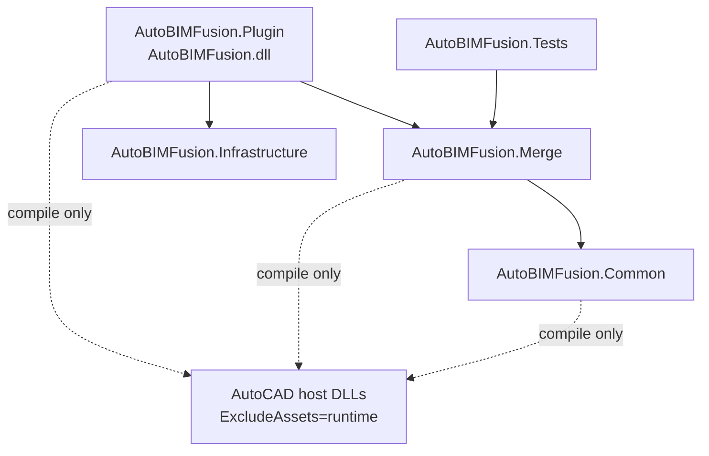

# Структура проекта AutoBIMFusion

**Последнее обновление:** 2026-05-15

## Цель структуры

Решение разделено на модули, чтобы AutoCAD entrypoint, merge pipeline, общие AutoCAD helpers и инфраструктура развивались независимо. Runtime-контракт автозагрузки сохранен: `AutoBIMFusion.bundle` загружает `Contents/AutoBIMFusion.dll`.

A25/A26 конфигурации используют `net8.0`; A27 использует `net10.0`, потому что `AutoCAD.NET 26.x` несовместим с `net8.0`.

## Проекты

```text
src/
  AutoBIMFusion.Plugin/
    AutoBIMFusionExtension.cs
    Commands/
      CombineCommands.cs
      Archive/
    Ribbon/
    Resources/
  AutoBIMFusion.Merge/
    Combine/
      ├── BlockInserter.cs
      ├── CombineOrchestrator.cs
      ├── CombineResult.cs
      ├── CombineStatistics.cs
      ├── PhantomBlockCleaner.cs
      ├── BlockBasePointEditor.cs
      ├── BlockScaleApplier.cs
      ├── DrawingPurger.cs
      ├── RasterImagePathFixer.cs
      └── Layouts/
          ├── ViewportLayoutExporter.cs
          ├── LayoutProjectionProcessor.cs
          ├── ViewportCollector.cs
          ├── ViewportInfo.cs
          ├── ViewportTransformer.cs
          ├── ViewportScaleNormalizer.cs
          ├── ModelSpaceTrimmer.cs
          ├── DrawOrderPreserver.cs
          ├── DimensionStyleNormalizer.cs
          ├── StyleUnificationService.cs
          └── DimensionStyleDiagnosticUtils.cs
  AutoBIMFusion.Common/
    ├── AcadSupport/
    │   ├── AcadWarningSuppressScope.cs
    │   └── DatabaseUnitSyncScope.cs
    ├── Extensions/          (30 файлов extension methods)
    ├── Drawing/
    │   ├── BlockReferences.cs
    │   └── Entities.cs
    ├── Mist/
    │   ├── Generic.cs
    │   ├── AutoCAD/
    │   └── Geometry/
    ├── Helpers/
    │   ├── ExtentsUtils.cs
    │   ├── FileUtil.cs
    │   ├── EntityTransformUtils.cs
    │   └── LayoutUtil.cs
    ├── UiDialogService.cs
    ├── WindowsNaturalComparer.cs
    └── Logging/
        └── LoggerFactory.cs
  AutoBIMFusion.Infrastructure/
    Logging/
tests/
  AutoBIMFusion.Tests/
docs/
```

| Проект | Output | Роль |
|---|---|---|
| `src/AutoBIMFusion.Plugin` | `AutoBIMFusion.dll` | AutoCAD plugin assembly: extension application, command classes, Ribbon, bundle packaging |
| `src/AutoBIMFusion.Merge` | `AutoBIMFusion.Merge.dll` | DWG merge pipeline and layout algorithms |
| `src/AutoBIMFusion.Common` | `AutoBIMFusion.Common.dll` | Shared AutoCAD helpers and scopes |
| `src/AutoBIMFusion.Infrastructure` | `AutoBIMFusion.Infrastructure.dll` | Logging and infrastructure code |
| `tests/AutoBIMFusion.Tests` | `AutoBIMFusion.Tests.exe` | Smoke-test executable |

## Dependency graph



## Bundle ownership

Only `AutoBIMFusion.Plugin.csproj` owns bundle creation and deployment:

- creates `AutoBIMFusion.bundle`
- writes `PackageContents.xml`
- copies `AutoBIMFusion.dll`
- copies module DLLs
- copies Serilog runtime DLLs
- deploys to `%AppData%\Autodesk\ApplicationPlugins\AutoBIMFusion.bundle`

Module projects are class libraries and must not deploy bundles.

## Public API boundaries

Keep only cross-project entry points public:

- `AutoBIMFusion.Merge.CombineOrchestrator.MergeSingleFile(...)`
- `AutoBIMFusion.Merge.BlockInserter`
- `AutoBIMFusion.Merge.CombineStatistics`
- `AutoBIMFusion.Merge.CombineResult`
- `AutoBIMFusion.Merge.RasterImagePathFixer`
- `AutoBIMFusion.Merge.DrawingPurger`
- `AutoBIMFusion.Merge.PhantomBlockCleaner`
- `AutoBIMFusion.Merge.BlockBasePointEditor`
- `AutoBIMFusion.Merge.BlockScaleApplier`
- `AutoBIMFusion.Infrastructure.Logging.LoggerFactory`
- required helpers under `AutoBIMFusion.Common`

Layout algorithms remain internal where possible. `AutoBIMFusion.Merge` exposes internals to `AutoBIMFusion.Tests` for focused smoke testing.

## Build commands

```powershell
dotnet build AutoBIMFusion.slnx -c DebugA26
dotnet build AutoBIMFusion.slnx -c DebugA26 /p:CoreConsoleDiagnostics=true
dotnet run --project tests/AutoBIMFusion.Tests/AutoBIMFusion.Tests.csproj -c DebugA26
```

Release matrix:

```powershell
dotnet build AutoBIMFusion.slnx -c ReleaseA25
dotnet build AutoBIMFusion.slnx -c ReleaseA26
dotnet build AutoBIMFusion.slnx -c ReleaseA27
```

## Headless diagnostics

`tools/Run-MergeDwgDiagTest.ps1` remains a known broken diagnostic helper because it calls missing command `MERGEDWG_DIAG_TEST`. It is not an acceptance gate until the command is restored or the script is changed.
